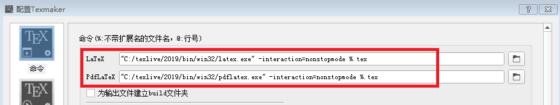

***
本文档记录了texmaker+texlive在win7 64位系统环境下的部署步骤.

***

+ 环境及固件准备
  
  + win7 64 bit
    
  + **Texmaker\_5.0.3\_Win\_x64.msi**
    
  + **texlive2019-20190410.iso**
    
  + [texmarker+texlive百度网盘下载地址](https://pan.baidu.com/s/13kfqYl6Zvo4prbqGIKdSJQ )
  
+ 安装过程

  + 安装**Texmaker\_5.0.3\_Win\_x64.msi**文件
  
  + 使用虚拟光驱加载**texlive2019-20190410.iso**,运行安装脚本文件:**install-tl-advanced.bat**,默认路径安装,预计持续半个小时.
  
  + 打开Texmaker-选项-配置Texmaker,配置选中$LaTeX$和$PdfLaTex$对应所在的路径即可,设置完成后的效果如下图所示
  
    

***

+ 编写代码和pdf生成阅读

  + 打卡**texmaker**;
  
  + 文件(新建)-文件(另存为)，得到**first.tex**文件;
  
  + 在**first.tex**中编写文档;
  
  + 在**texmaker**窗口的工具栏下有两个很明显的箭头按钮,第一个箭头对应文件编译器,第二个箭头对应文件阅读器,我们可以利用这两个工具选择我们要生成的文件和预览的文件.
  
    
  

  + 选中**PDFLaTex**,鼠标左键单击"箭头"生成,若文档中无错误,就会生成**first.pdf**文件
  
    
    
    
  
  + 生成的**first.pdf**文件可以直接用pdf阅读器进行阅读;
  
  + **texmaker**也提供了pdf文件的预览工具,同名pdf文件生成以后,选中pdf文件然后鼠标左键单击"箭头"即可在**texmaker**的右侧预览窗口看到pdf文件的内容.
  
    
    
    

+ Ref
  
  1. [latex中的texlive+texmaker使用](https://my.oschina.net/u/3110937/blog/1794945 )
  
  2. [texmaker下载地址](https://www.xm1math.net/texmaker/ ) 
  
  3. [texlive iso资源页面](http://tug.org/texlive/acquire-iso.html )
  
  4. [LaTeX初识 新手入门 Texlive和Texmaker学习](https://www.cnblogs.com/hellowooorld/p/6971974.html )

***

    AlimyBreak

    2019.12.09

